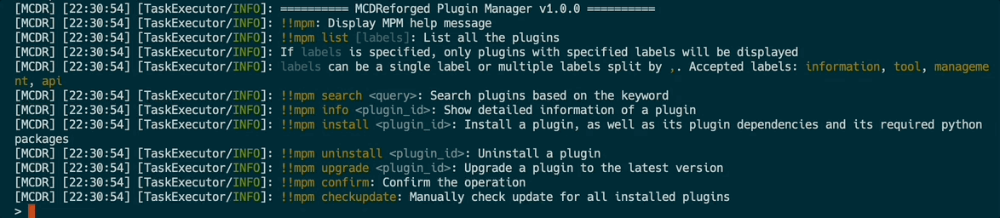

MCDReforgedPluginManager
-----

> [!TIP]
> Deprecated, use [MCDR's build-in plugin installer](https://docs.mcdreforged.com/en/latest/command/mcdr.html#plugin-catalogue-access) instead

**English** | [中文](./README_cn.md)

> Manage your mcdreforged plugins with ease

MCDReforgedPluginManager (short for `mpm`) is a MCDReforged plugin manager based on [PluginCatalogue](https://github.com/MCDReforged/PluginCatalogue)

MCDReforgedPluginManager fetch plugin metadata from [PluginCatalogue](https://github.com/MCDReforged/PluginCatalogue) and update automatically at regular intervals



## Features

- Dependency checking
- Update checking
- Plugin installation & uninstallation
- Plugin upgrading
- Plugin searching

## Requirements

[MCDReforged](https://github.com/Fallen-Breath/MCDReforged) requirement: `>=2.0.0`

Python package requirements: See [requirements.txt](https://github.com/Ivan-1F/MCDReforgedPluginManager/blob/master/requirements.txt)

## Configuration

The configuration file is `config/mcdreforged_plugin_manager/config.yml`

The commented default config file will be generated when mpm is loaded for the first time:

```yaml
# Configure file for MCDReforgedPluginManager


# The minimum permission level to use MPM commands
# 使用 MCDReforgedPluginManager 指令的最低权限
permission: 4

# The source of plugin catalogue to fetch data, should be the url to download the whole meta branch
# 插件仓库数据源，应是下载整个 meta 分支的链接
source: https://github.com/MCDReforged/PluginCatalogue/archive/refs/heads/meta.zip

# The timeout for network requests
# 网络请求的超时时间
timeout: 5

# The time interval between each cache (unit: minute)
# 定时更新插件索引的时间间隔（单位：分钟）
cache_interval: 2

# If set to true, the plugin will check plugin updates after each scheduled cache
# 若设为 true，插件将在每次定时更新插件索引后自动检查更新
check_update: true

# The path to install the plugin, should be one of the value of 'plugin_directories' of the MCDR config
# 安装插件的位置，应是 MCDR 配置中的 'plugin_directories' 中的一个
install_path: plugins

# Proxy addresses, both http and https is optional
# 代理地址，http 与 https 都是可选的
proxy:
  http:
  https:
```

Follow the comments and modify the config, use `!!MCDR plg reload mcdreforged_plugin_manager` to reload the config

## Commands

- `!!mpm`: Display MPM help message
- `!!mpm list [labels]`: List all the plugins. 
  - If labels is specified, only plugins with specified labels will be displayed
  - `labels` can be a single label or multiple labels split by `,`. Accepted labels: `information`, `tool`, `management`, `api`
- `!!mpm search <query>`: Search plugins based on the keyword
- `!!mpm info <plugin_id>`: Show detailed information of a plugin
- `!!mpm install <plugin_ids>`: Install plugins, as well plugin dependencies and required python packages
- `!!mpm uninstall <plugin_ids>`: Uninstall plugins
- `!!mpm upgrade <plugin_ids>`: Upgrade plugins to the latest version
- `!!mpm confirm`: Confirm the operation
- `!!mpm checkupdate`: Manually check update for all installed plugins
