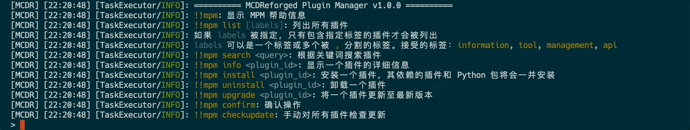

MCDReforgedPluginManager
-----

[English](./README_cn.md) | **中文**

> 轻松管理你的 MCDReforged 插件

MCDReforgedPluginManager（简称为 `mpm`）是一个基于 [PluginCatalogue](https://github.com/MCDReforged/PluginCatalogue) 的 MCDReforged 插件管理器

MCDReforgedPluginManager 从 [PluginCatalogue](https://github.com/MCDReforged/PluginCatalogue) 获取插件数据并定时更新



## 功能

- 依赖检查
- 更新检查
- 插件安装 & 卸载
- 插件更新
- 插件搜索

## 依赖

- [MCDReforged](https://github.com/Fallen-Breath/MCDReforged) >=2.0.0

## 配置

配置文件位于 `config/mcdreforged_plugin_manager/config.yml`

带注释的默认配置文件将在 mpm 第一次被加载时自动生成：

```yaml
# Configure file for MCDReforgedPluginManager


# The minimum permission level to use MPM commands
# 使用 MCDReforgedPluginManager 指令的最低权限
permission: 4

# The source of plugin catalogue to fetch data
# 插件仓库数据源
# Options 选项:
# - https://raw.githubusercontent.com/MCDReforged/PluginCatalogue/meta
# - https://cdn.jsdelivr.net/gh/MCDReforged/PluginCatalogue@meta
source: https://cdn.jsdelivr.net/gh/MCDReforged/PluginCatalogue@meta

# The timeout for network requests
# 网络请求的超时时间
timeout: 5

# The time interval between each cache (unit: minute)
# 定时更新插件索引的时间间隔（单位：分钟）
cache_interval: 2

# If set to true, the plugin will check plugin updates after each scheduled cache
# 若设为 true，插件将在每次定时更新插件索引后自动检查更新
check_update: true
```

根据注释修改配置，使用 `!!MCDR plg reload mcdreforged_plugin_manager` 重载配置

## 命令

- `!!mpm`: 显示 MPM 帮助信息
- `!!mpm list [labels]`: 列出所有插件
  如果 `labels` 被指定，只有包含指定标签的插件才会被列出
  `labels` 可以是一个标签或多个被 `,` 分割的标签。接受的标签：`information`, `tool`, `management`, `api`
- `!!mpm search <query>`: 根据关键词搜索插件
- `!!mpm info <plugin_id>`: 显示一个插件的详细信息
- `!!mpm install <plugin_id>`: 安装一个插件，其依赖的插件和 Python 包将会一并安装
- `!!mpm uninstall <plugin_id>`: 卸载一个插件
- `!!mpm upgrade <plugin_id>`: 将一个插件更新至最新版本
- `!!mpm confirm`: 确认操作
- `!!mpm checkupdate`: 手动对所有插件检查更新